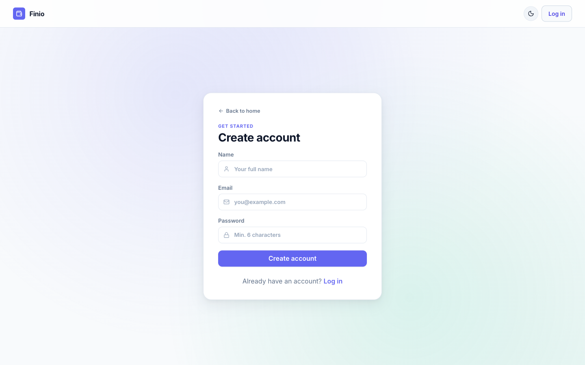

# 💸 Finio — AI-Powered Personal Finance Tracker

A full-stack personal finance web app built with React, Node.js, and MongoDB. Track your expenses, visualise spending by category, filter by month, and get on-demand AI-powered insights from Google Gemini — with a graceful local fallback when the API is unavailable.


---

## 🚀 Live Demo

**[https://personal-finance-tracker-pi.vercel.app](https://personal-finance-tracker-pi.vercel.app)**

Try it instantly with the demo account — no sign-up needed:

| Field | Value |
|---|---|
| Email | `demo@finio.app` |
| Password | `demo1234` |

---

## ✨ Features

- **JWT Authentication** — register and login with bcrypt-hashed passwords and stateless JWT sessions
- **Expense CRUD** — add, edit, and delete expenses with title, amount, category, date, and notes
- **Month / year filtering** — view spending scoped to any month with prev/next navigation
- **Spending chart** — interactive donut chart grouped by category (Recharts)
- **4 stat cards** — total spent, transaction count, top category, and average per expense
- **AI insights** — on-demand Gemini-powered spending analysis with automatic local fallback
- **Dark mode** — full light and dark theme, persisted across sessions, no flash on reload
- **Toast notifications** — non-blocking success and error feedback on every action
- **Skeleton loaders** — layout-matched loading state on first fetch
- **Account page** — update profile, change password, delete account
- **Landing page** — marketing page with feature highlights and live dashboard preview
- **Responsive** — works on mobile, tablet, and desktop

### Security
- Rate-limited auth endpoints (10 req / 15 min per IP)
- Input validation with `express-validator`
- CORS restricted to configured origin
- Security headers via `helmet`
- Error messages never leak stack traces in production

---

## 🛠 Tech Stack

| Layer | Technologies |
|---|---|
| **Frontend** | React 18, Vite 6, Redux Toolkit, React Router v7, Recharts, Axios, Lucide React, react-hot-toast |
| **Backend** | Node.js, Express 4, MongoDB, Mongoose 8 |
| **Auth** | JWT (jsonwebtoken), bcryptjs |
| **AI** | Google Gemini API (`gemini-2.5-flash`) with multi-model fallback |
| **Security** | helmet, express-rate-limit, express-validator |

---

## 📁 Project Structure

```
personal-finance-tracker/
├── client/                     # React / Vite frontend
│   ├── index.html
│   ├── vite.config.js
│   └── src/
│       ├── api/                # Axios instance with auth interceptor
│       ├── app/                # Redux store
│       ├── components/         # Reusable UI components
│       │   ├── AIInsightCard.jsx
│       │   ├── ConfirmDialog.jsx
│       │   ├── ExpenseForm.jsx
│       │   ├── ExpenseList.jsx
│       │   ├── MonthFilter.jsx
│       │   ├── ProtectedRoute.jsx
│       │   ├── SkeletonDashboard.jsx
│       │   ├── SpendingChart.jsx
│       │   └── ThemeToggle.jsx
│       ├── features/
│       │   ├── auth/           # Auth Redux slice
│       │   └── expenses/       # Expenses Redux slice
│       ├── lib/                # Shared utilities (format, categories)
│       ├── pages/              # Route-level pages
│       │   ├── Account.jsx
│       │   ├── Dashboard.jsx
│       │   ├── Landing.jsx
│       │   ├── Login.jsx
│       │   └── Register.jsx
│       └── styles/             # Global CSS with design tokens
│
└── server/                     # Express API
    └── src/
        ├── config/             # MongoDB connection
        ├── controllers/        # Route handlers
        ├── middleware/         # Auth, error handling, validation, rate limiting
        ├── models/             # Mongoose schemas (User, Expense)
        └── routes/             # Express routers
```

---

## 🚀 Local Setup

### Prerequisites

- **Node.js** 18 or later
- **npm** 9 or later
- A **MongoDB** database — [MongoDB Atlas](https://www.mongodb.com/atlas) free tier works fine
- A **Google Gemini API key** — [get one free](https://aistudio.google.com/app/apikey) (optional — the app works without it)

### 1. Clone the repo

```bash
git clone https://github.com/your-username/personal-finance-tracker.git
cd personal-finance-tracker
```

### 2. Install dependencies

```bash
# Install server dependencies
cd server && npm install

# Install client dependencies
cd ../client && npm install
```

### 3. Configure environment variables

```bash
cp server/.env.example server/.env
```

Open `server/.env` and fill in your values:

```env
MONGO_URI=mongodb+srv://<user>:<password>@cluster.mongodb.net/personal-finance-tracker
JWT_SECRET=replace_with_a_long_random_string
GEMINI_API_KEY=your_gemini_api_key_here   # leave blank to use local fallback
CLIENT_ORIGIN=http://localhost:5173
NODE_ENV=development
```

> **Tip:** Generate a strong JWT secret with `openssl rand -hex 64`

The client `.env` can stay empty for local development — the Vite dev server proxies all `/api/*` requests to `localhost:4000` automatically.

### 4. Start the development servers

Open two terminal tabs:

```bash
# Tab 1 — API server (http://localhost:4000)
cd server && npm run dev

# Tab 2 — React app (http://localhost:5173)
cd client && npm run dev
```

Open [http://localhost:5173](http://localhost:5173) in your browser.

---

## 🌐 API Reference

All protected routes require an `Authorization: Bearer <token>` header.

| Method | Endpoint | Auth | Description |
|--------|----------|:----:|-------------|
| `POST` | `/api/auth/register` | — | Register a new user |
| `POST` | `/api/auth/login` | — | Login, returns JWT |
| `GET` | `/api/expenses` | ✓ | List expenses (`?month=5&year=2026`) |
| `POST` | `/api/expenses` | ✓ | Create an expense |
| `PUT` | `/api/expenses/:id` | ✓ | Update an expense |
| `DELETE` | `/api/expenses/:id` | ✓ | Delete an expense |
| `POST` | `/api/finance/analyze` | ✓ | AI spending analysis |
| `GET` | `/api/user/profile` | ✓ | Get profile + expense count |
| `PUT` | `/api/user/profile` | ✓ | Update name / email |
| `PUT` | `/api/user/password` | ✓ | Change password |
| `DELETE` | `/api/user/account` | ✓ | Delete account + all data |
| `GET` | `/api/health` | — | Health check |

### Expense object

```json
{
  "_id": "...",
  "title": "Lunch at Swiggy",
  "amount": 350,
  "category": "Food",
  "date": "2026-05-20T00:00:00.000Z",
  "note": "Biryani",
  "userId": "...",
  "createdAt": "...",
  "updatedAt": "..."
}
```

**Valid categories:** `Food`, `Transport`, `Shopping`, `Health`, `Entertainment`, `Bills`, `Other`

---

## ☁️ Production Deployment

### Backend — Railway / Render / Fly.io

1. Push the `server/` directory (or the whole repo) to your platform
2. Set the following environment variables in your hosting dashboard:

```env
MONGO_URI=your_production_mongodb_uri
JWT_SECRET=a_long_random_secret
GEMINI_API_KEY=your_gemini_api_key
CLIENT_ORIGIN=https://your-finio-app.vercel.app
NODE_ENV=production
PORT=4000
```

3. Set the start command to `npm start`

### Frontend — Vercel / Netlify

1. Set the build command to `npm run build` and output directory to `dist`
2. Add this environment variable:

```env
VITE_API_BASE_URL=https://your-finio-api.railway.app
```

3. For Vercel, add a `vercel.json` at the root of the `client/` folder to handle client-side routing:

```json
{
  "rewrites": [{ "source": "/(.*)", "destination": "/index.html" }]
}
```

---

## 📸 Screenshots

### Landing page


### Register


### Dashboard (light mode)


### Dashboard (dark mode)


### AI spending insight


### Account settings


---

