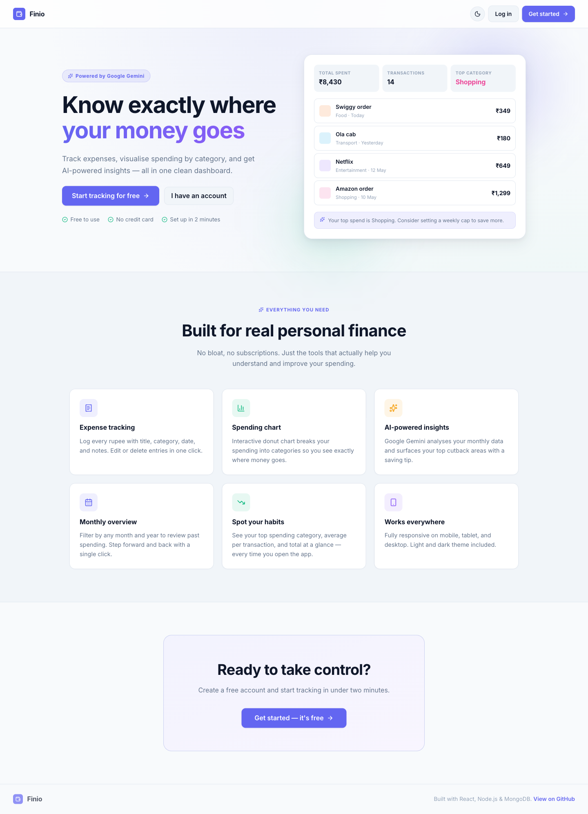
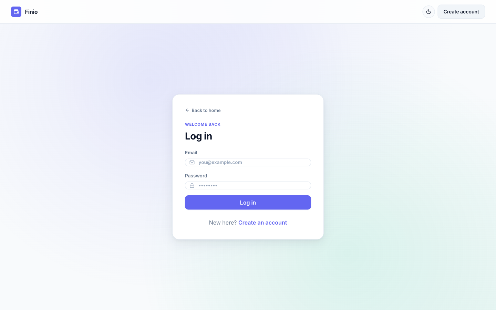
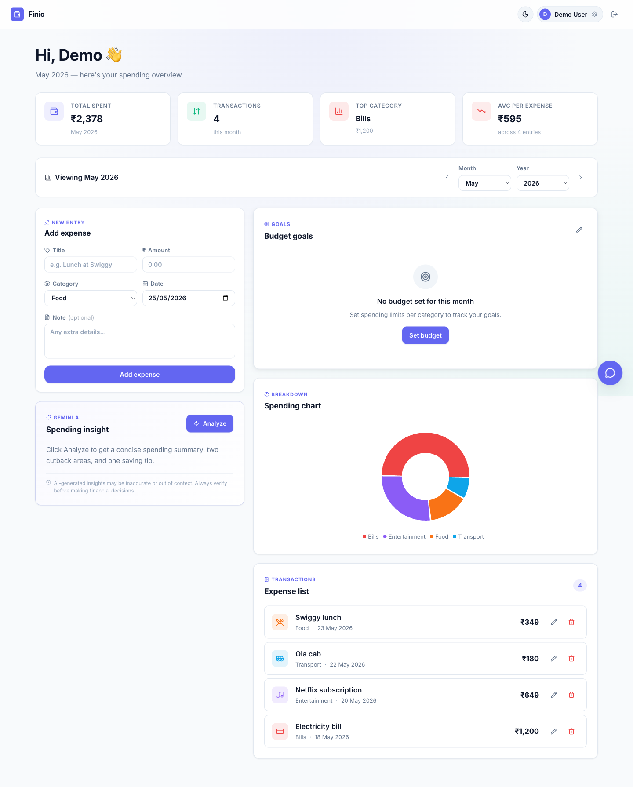
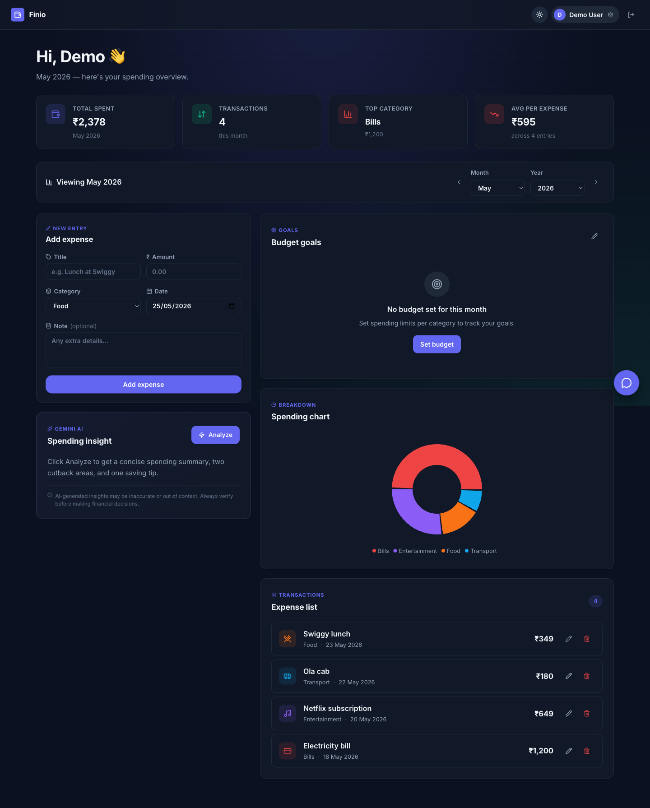
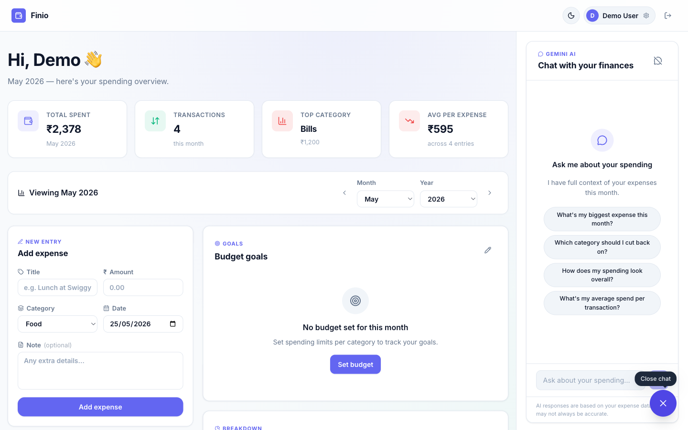
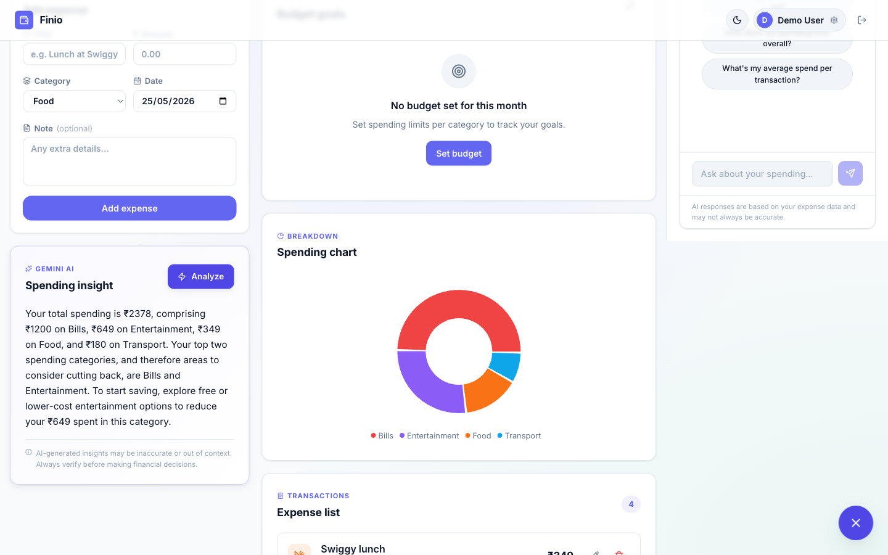
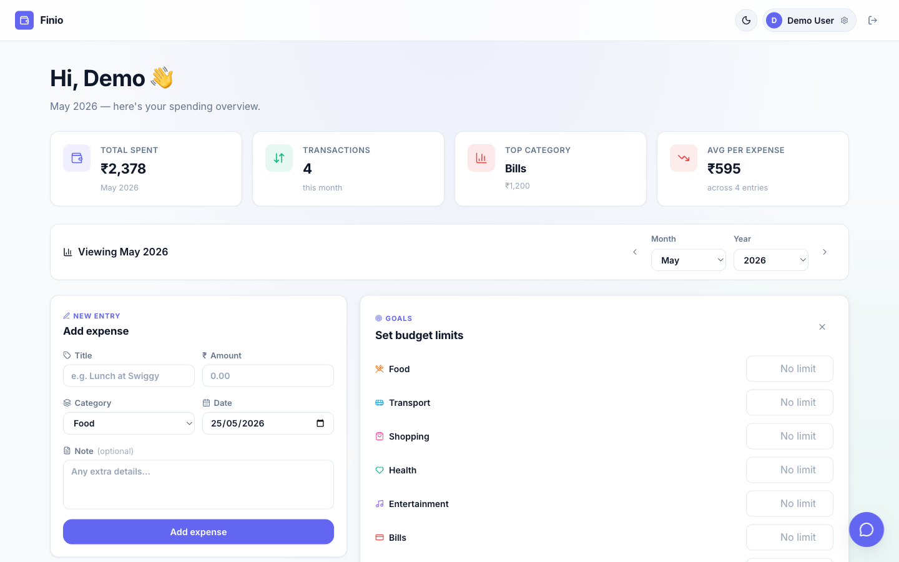
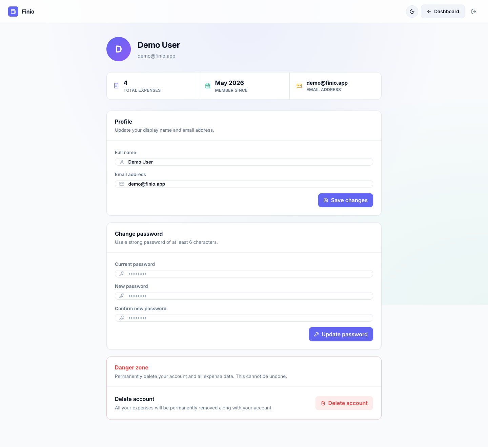

# 💸 Finio — AI-Powered Personal Finance Tracker

A full-stack personal finance web app built with React, Node.js, and MongoDB. Track expenses, visualise spending by category, set monthly budget goals, chat with your data using Google Gemini, and get on-demand AI insights — all in one production-ready dashboard.


---

## 🚀 Live Demo

**[https://personal-finance-tracker-pi.vercel.app](https://personal-finance-tracker-pi.vercel.app)**

Try it instantly — no sign-up needed:

| Field | Value |
|---|---|
| Email | `demo@finio.app` |
| Password | `demo1234` |

---

## ✨ Features

### Core
- **JWT Authentication** — register and login with bcrypt-hashed passwords and stateless JWT sessions
- **Expense CRUD** — add, edit, and delete expenses with title, amount, category, date, and notes
- **Month / year filtering** — view spending scoped to any month with prev/next navigation
- **4 stat cards** — total spent, transaction count, top category, and average per expense

### AI
- **AI spending insights** — on-demand Gemini analysis with automatic local fallback when the API is unavailable
- **AI chat** — conversational interface to ask questions about your own expense data; Gemini receives your full monthly context on every message
- **AI disclaimer** — all AI responses include a disclaimer and are clearly labelled when falling back to local analysis

### Visualisation
- **Spending chart** — interactive donut chart grouped by category (Recharts)
- **Budget goals** — set monthly spending limits per category with colour-coded progress bars (green → amber → red)

### UX
- **Landing page** — marketing page with feature highlights and a live dashboard preview
- **Dark mode** — full light/dark theme toggle, persisted to `localStorage`, no flash on reload
- **Responsive layout** — works on mobile, tablet, and desktop
- **Floating chat FAB** — always-visible chat button in the bottom-right corner; opens as a sidebar on desktop and a bottom-sheet modal on mobile
- **Toast notifications** — non-blocking success and error feedback on every action
- **Skeleton loaders** — layout-matched loading state on first fetch
- **Confirm dialogs** — accessible modal confirmation for destructive actions

### Account
- **Profile management** — update name and email
- **Password change** — requires current password verification
- **Account deletion** — permanently removes account and all expense data (password-confirmed)

### Security
- Rate-limited auth endpoints (10 req / 15 min per IP)
- Input validation with `express-validator` on all routes
- CORS restricted to configured origin
- Security headers via `helmet`
- Error messages never leak stack traces in production
- JWT secret enforced at startup

---

## 🛠 Tech Stack

| Layer | Technologies |
|---|---|
| **Frontend** | React 18, Vite 6, Tailwind CSS v3, Redux Toolkit, React Router v7, Recharts, Axios, Lucide React, react-hot-toast |
| **Backend** | Node.js, Express 4, MongoDB, Mongoose 8 |
| **Auth** | JWT (jsonwebtoken), bcryptjs |
| **AI** | Google Gemini API (`gemini-2.5-flash`) with multi-model fallback chain |
| **Security** | helmet, express-rate-limit, express-validator |

---

## 📁 Project Structure

```
finio/
├── client/                          # React / Vite frontend
│   ├── index.html
│   ├── tailwind.config.js
│   ├── postcss.config.js
│   ├── vite.config.js
│   └── src/
│       ├── api/                     # Axios instance with auth interceptor
│       ├── app/                     # Redux store
│       ├── components/
│       │   ├── AIInsightCard.jsx    # On-demand Gemini spending analysis
│       │   ├── BudgetGoals.jsx      # Monthly budget limits with progress bars
│       │   ├── ConfirmDialog.jsx    # Accessible confirmation modal
│       │   ├── ExpenseForm.jsx      # Add / edit expense form
│       │   ├── ExpenseList.jsx      # Expense rows with edit/delete
│       │   ├── FinanceChat.jsx      # Conversational AI chat panel
│       │   ├── MonthFilter.jsx      # Month/year selector with prev/next
│       │   ├── ProtectedRoute.jsx   # Auth guard
│       │   ├── SkeletonDashboard.jsx
│       │   ├── SpendingChart.jsx    # Recharts donut chart
│       │   └── ThemeToggle.jsx      # Light/dark toggle
│       ├── features/
│       │   ├── auth/                # Auth Redux slice
│       │   ├── budgets/             # Budget Redux slice
│       │   ├── chat/                # Chat Redux slice
│       │   └── expenses/            # Expenses Redux slice
│       ├── lib/
│       │   ├── categories.js        # Category icons + colours (single source of truth)
│       │   └── format.js            # Currency + date formatters
│       ├── pages/
│       │   ├── Account.jsx
│       │   ├── Dashboard.jsx
│       │   ├── Landing.jsx
│       │   ├── Login.jsx
│       │   └── Register.jsx
│       └── styles/
│           └── global.css           # CSS tokens + Tailwind directives
│
└── server/                          # Express API
    └── src/
        ├── config/                  # MongoDB connection
        ├── controllers/
        │   ├── authController.js
        │   ├── budgetController.js
        │   ├── expenseController.js
        │   ├── financeController.js # AI analyze + chat endpoints
        │   └── userController.js
        ├── middleware/
        │   ├── asyncHandler.js
        │   ├── authMiddleware.js
        │   ├── errorMiddleware.js
        │   └── validateMiddleware.js
        ├── models/
        │   ├── Budget.js
        │   ├── Expense.js
        │   └── User.js
        └── routes/
            ├── authRoutes.js
            ├── budgetRoutes.js
            ├── expenseRoutes.js
            ├── financeRoutes.js
            └── userRoutes.js
```

---

## 🚀 Local Setup

### Prerequisites

- **Node.js** 18 or later
- **npm** 9 or later
- A **MongoDB** database — [MongoDB Atlas](https://www.mongodb.com/atlas) free tier works fine
- A **Google Gemini API key** — [get one free](https://aistudio.google.com/app/apikey) (optional — the app works without it)

### 1. Clone the repo

```bash
git clone https://github.com/raz001/personal-finance-tracker.git
cd personal-finance-tracker
```

### 2. Install dependencies

```bash
cd server && npm install
cd ../client && npm install
```

### 3. Configure environment variables

```bash
cp server/.env.example server/.env
```

Open `server/.env` and fill in your values:

```env
MONGO_URI=mongodb+srv://<user>:<password>@cluster.mongodb.net/finio
JWT_SECRET=replace_with_a_long_random_string
GEMINI_API_KEY=your_gemini_api_key_here   # leave blank to use local fallback
CLIENT_ORIGIN=http://localhost:5173
NODE_ENV=development
```

> **Tip:** Generate a strong JWT secret with `openssl rand -hex 64`

The client `.env` can stay empty for local development — the Vite dev server proxies all `/api/*` requests to `localhost:4000` automatically.

### 4. Start the development servers

```bash
# Tab 1 — API server (http://localhost:4000)
cd server && npm run dev

# Tab 2 — React app (http://localhost:5173)
cd client && npm run dev
```

Open [http://localhost:5173](http://localhost:5173) in your browser.

---

## 🌐 API Reference

All protected routes require an `Authorization: Bearer <token>` header.

| Method | Endpoint | Auth | Description |
|--------|----------|:----:|-------------|
| `POST` | `/api/auth/register` | — | Register a new user |
| `POST` | `/api/auth/login` | — | Login, returns JWT |
| `GET` | `/api/expenses` | ✓ | List expenses (`?month=5&year=2026`) |
| `POST` | `/api/expenses` | ✓ | Create an expense |
| `PUT` | `/api/expenses/:id` | ✓ | Update an expense |
| `DELETE` | `/api/expenses/:id` | ✓ | Delete an expense |
| `POST` | `/api/finance/analyze` | ✓ | One-shot AI spending analysis |
| `POST` | `/api/finance/chat` | ✓ | Multi-turn AI chat with expense context |
| `GET` | `/api/budgets` | ✓ | Get budget for a month (`?month=5&year=2026`) |
| `PUT` | `/api/budgets` | ✓ | Create or update monthly budget limits |
| `DELETE` | `/api/budgets/:month/:year` | ✓ | Delete a monthly budget |
| `GET` | `/api/user/profile` | ✓ | Get profile + total expense count |
| `PUT` | `/api/user/profile` | ✓ | Update name / email |
| `PUT` | `/api/user/password` | ✓ | Change password |
| `DELETE` | `/api/user/account` | ✓ | Delete account + all data |
| `GET` | `/api/health` | — | Health check |

### Expense object

```json
{
  "_id": "...",
  "title": "Lunch at Swiggy",
  "amount": 350,
  "category": "Food",
  "date": "2026-05-20T00:00:00.000Z",
  "note": "Biryani",
  "userId": "...",
  "createdAt": "...",
  "updatedAt": "..."
}
```

**Valid categories:** `Food`, `Transport`, `Shopping`, `Health`, `Entertainment`, `Bills`, `Other`

### Budget object

```json
{
  "_id": "...",
  "userId": "...",
  "month": 5,
  "year": 2026,
  "limits": [
    { "category": "Food", "amount": 5000 },
    { "category": "Transport", "amount": 2000 }
  ]
}
```

---

## ☁️ Production Deployment

### Backend — Railway / Render / Fly.io

Set these environment variables on your hosting platform:

```env
MONGO_URI=your_production_mongodb_uri
JWT_SECRET=a_long_random_secret
GEMINI_API_KEY=your_gemini_api_key
CLIENT_ORIGIN=https://your-finio-app.vercel.app
NODE_ENV=production
PORT=4000
```

Start command: `npm start`

> **Note:** If deploying to Render free tier, MongoDB Atlas must allow connections from all IPs (`0.0.0.0/0`) since Render uses dynamic IPs.

### Frontend — Vercel / Netlify

Set this environment variable:

```env
VITE_API_BASE_URL=https://your-finio-api.railway.app
```

Build command: `npm run build` · Output directory: `dist`

For Vercel, add `client/vercel.json` to handle client-side routing:

```json
{
  "rewrites": [{ "source": "/(.*)", "destination": "/index.html" }]
}
```

---

## 📸 Screenshots

### Landing page


### Login


### Dashboard (light mode)


### Dashboard (dark mode)


### AI chat sidebar


### AI spending insight


### Budget goals


### Account settings

